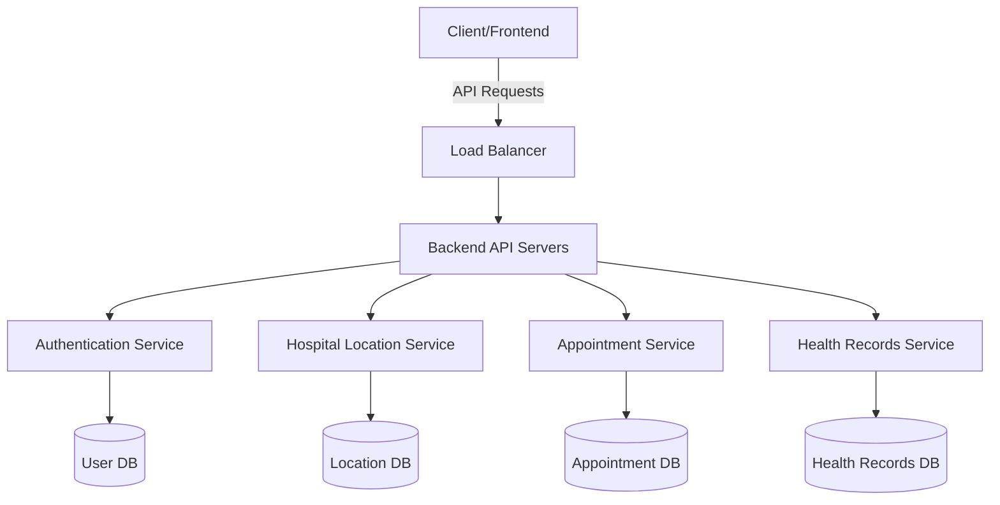

<div align="center">

# 🏥 HEALTH-RECORD-APP

### Your Complete Healthcare Management Solution


[](https://codecov.io/gh/username/mediconnect-pro)


## A comprehensive MERN-stack healthcare management system that revolutionizes how patients interact with healthcare providers.

[Live Demo](https://demo-link.com) • [API Documentation](https://api-docs.mediconnect-pro.com) • [Contributing](#contributing) • [Report Issues](https://github.com/username/mediconnect-pro/issues)

</div>

## 📑 Table of Contents

- [Overview](#overview)
- [Core Functionalities](#-key-features)
- [System Architecture](#-system-architecture)
- [Project Structure](#-project-structure)
- [Technology Stack](#-technology-stack)
- [Getting Started](#-getting-started)
- [API Documentation](#-api-documentation)
- [Deployment](#-deployment)
- [Security Measures](#-security-measures)
- [Contributing](#-contributing)
- [License](#-license)

## Overview

The project aims to create a comprehensive healthcare platform that enhances the accessibility and management of healthcare services for users. The system leverages APIs, databases, and user-centric design to provide essential functionalities like hospital location tracking, health data management, record accessibility, and appointment scheduling

## 🌟 Core Functionalities

### 1. Nearby Hospital Locator 🏥

- Interactive map interface using Google Maps API
- Real-time hospital search based on current location
- Detailed hospital information including:
  - Operating hours
  - Emergency services availability
  - Specialties and departments
  - Ratings and reviews
  - Contact information
- Custom filtering options (by specialty, insurance accepted, etc.)
- Distance calculation and route planning

### 2. User Authentication & Health Data Management 🔐

- Secure JWT-based authentication system
- OAuth2.0 integration (Google, Facebook, Apple)
- Role-based access control (Patients, Doctors, Administrators)
- Two-factor authentication
- Complete user profile management
- HIPAA-compliant data storage
- Audit logging for all data access

### 3. Health Records Management 📊

- Comprehensive electronic health record (EHR) system
- Integration with FHIR API for standardized health data
- Support for multiple file formats (PDF, DICOM, etc.)
- Features include:
  - Medical history tracking
  - Prescription management
  - Lab results visualization
  - Vaccination records
  - Allergies and medications
  - Clinical notes and diagnoses

### 4. Appointment Scheduling System 📅

- Real-time availability checking
- Multiple appointment types support
- Features include:
  - Automated reminder system
  - Cancellation/rescheduling management
  - Virtual consultation booking
  - Emergency appointment requests
  - Waiting list management
  - Calendar synchronization (Google, Apple, Outlook)

## 🏗 System Architecture



## 📁 Project Structure

```bash
HEALTH-RECORD-APP/
├── Client/                 # React frontend application
│   ├── public/             # Static files
│   ├── src/
│   │   ├── components/     # Reusable React components
│   │   ├── assets/         # Reusable React components
│   │   ├── pages/          # Page components
│   │   ├── services/       # API service integrations
│   │   ├── context/        # React context providers
│   │   ├── utils/          # Utility functions
│   │   │── services/       # Images, styles, etc.
│   │   └── App.jsx/        # Handling routing and layout
│   ├── Index.html          # index file
│   └── package.json
│
└── server/                 # Node.js/Express backend
    ├── config/             #configurations
    ├── controllers/        # controllers
    ├── niddleware/         # middlewares
    ├── models/             # Models
    ├── routes/             # Routes
    ├── services/           # services
    ├── tests/              # TESTING
    └── package.json
```

## 🛠 Technology Stack

### Frontend

- **Framework**: React.js 18
- **State Management**: Redux Toolkit
- **Styling**: Tailwind CSS, Material-UI
- **Maps**:   API
- **Data Visualization**: Chart.js, D3.js
- **Testing**: Postman API
- **Build Tool**: Vite

### Backend

- **Runtime**: Node.js
- **Framework**: Express.js
- **Database**: MongoDB with Mongoose
- **Caching**: Redis
- **Authentication**: JWT, Passport.js
- **API Documentation**: Swagger/OpenAPI
- **Testing**: Mocha, Chai


## 🚀 Getting Started

### Prerequisites

- Node.js >= 16.x
- MongoDB >= 5.0
- Redis >= 6.0
- Docker (optional)

### Frontend Setup

```bash
# Navigate to frontend directory
cd client

# Install dependencies
npm install

# Set up environment variables
cp .env.example .env.local

# Start development server
npm run dev
```

### Backend Setup

```bash
# Navigate to backend directory
cd server

# Install dependencies
npm install

# Set up environment variables
cp .env.example .env

# Start development server
node app.js / nodemon app.js
```


## 📚 API Documentation

Detailed API documentation is available at:

- Development: `http://localhost:5000/api-docs`
- Production: `https://api.mediconnect-pro.com/docs`

### API Endpoints Overview

```markdown
POST /api/auth/register # User registration
POST /api/auth/login # User login
GET /api/hospitals/nearby # Find nearby hospitals
POST /api/appointments # Create appointment
GET /api/health-records # Fetch health records
```

## 🚢 Deployment

### Production Deployment

```bash
# Build frontend
cd frontend
npm run build

# Build backend
cd ../backend
npm run build

# Deploy using Docker
docker-compose -f docker-compose.prod.yml up -d
```

### Deployment Options

- AWS Elastic Beanstalk
- Google Cloud Platform
- Azure App Service
- Digital Ocean Droplets

## 🔒 Security Measures


- **Authentication**

  - JWT with refresh tokens
  - Password hashing using bcrypt
  - Rate limiting
  - Session management


## 🤝 Contributing

We welcome contributions! Please follow these steps:

1. Fork the repository
2. Create a feature branch: `git checkout -b feature/YourFeature`
3. Commit changes: `git commit -m 'Add YourFeature'`
4. Push to branch: `git push origin feature/YourFeature`
5. Submit a pull request

Read our [Contributing Guide](CONTRIBUTING.md) for detailed guidelines.


## 🌟 Acknowledgments

- vedant Dubey
- Hetharth Sachdeva
- Ayush Kumar singh


<div align="center" >

#### Made with ❤️ by the 
# <u>UNKNOWNCOOK ERROR</u> 
Team

[⬆ Back to Top](#mediconnect-pro)

</div>
